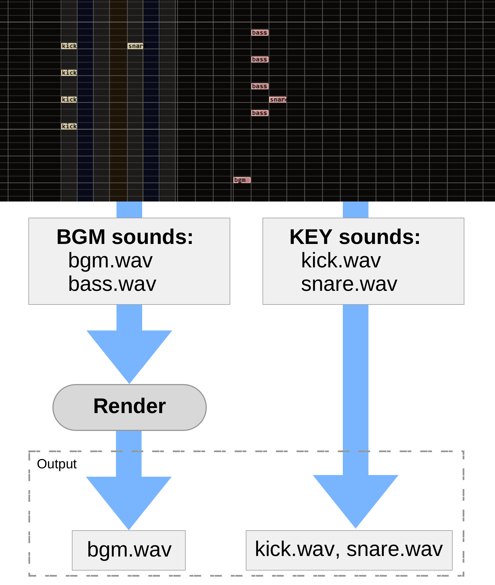

# bms-sound-optimizer

A simple script to look for background-only keysound files.

When distributing BMS for playing over the web (Bemuse), it is important to make
BMS package as small as possible.

This script helps optimize the sounds files by telling you which sounds files
are only used in the BGM track. They can be rendered into a single BGM file.

Uses [bemuse-notechart] under the hood.

[bemuse-notechart]:
  https://github.com/bemusic/bemuse/tree/master/packages/bemuse-notechart
